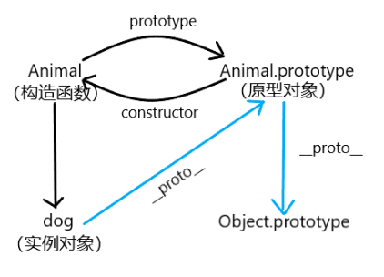

## 6.3继承

* 原型链
* 使用原型实现继承
* 解决constructor被覆盖问题
* 借用构造函数
* 组合继承

### 1.原型链
构造函数、原型、实例对象的关系如下图



每一个实例对象都存在一个__proto__属性用来指向它的实例原型，属性查找的顺序是按照上图中蓝色链条的顺寻来逐级访问的，通过这条原型链可以实现继承

### 2.使用原型链实现继承

``` JavaScript
function Person(){}
Person.prototype.sayHi = function() {
    console.log('hello world')
}

function Student(){}
Student.prototype = new Person()   //Student的原型赋值为Person的实例

const s1 = new Student()
s1.sayHi()                         //可以正确访问
```
使用原型来实现继承的关键一点就是将Student的原型赋值为Person的实例，此时Student的原型指向了Person的原型，构成了一条原型链，由Student实例化来的对象也可以访问Person上的方法。

**存在的副作用：**直接使用原型来实现继承还存在一点问题
``` JavaScript
s1.constructor === Person          //指向的是Person
```
1、由Student实例化而来的对象已经失去了它和实例化对象的关联，使用**Object.defainProperty**来配置属性。

### 3.解决constructor被覆盖问题
``` JavaScript
Object.defineProperty(Student.prototype,"constructor",{
    enumerable: true,
    value: Student,
    writable: true
})
```

使用**Object.defineProperty**重新建立了Student实例与构造函数的联系。

2、引用类型的属性被共享的问题
``` JavaScript
function Clothing(){
    this.color = ["red","blue"]
}
function Shoe() {}
Shoe.prototype = new Clothing()
let shoe1 = new Shoe()
let shoe2 = new Shoe()
shoe1.colors.push("yellow")
console.log(shoe1.colors)            //["red","blue","yellow"]
console.log(shoe2.colors)            //["red","blue","yellow"]
```
两个不同的实例的属性被共享了。

### 4.借用构造函数

解决原型中包含引用类型的属性被共享的问题，提出了一种借用构造函数的方式来实现继承。
``` JavaScript
function Phone() {
    this.colors = ["green", "white", "black"]
}

function MobiePhone() {
    //继承了Phone
    Phone.call(this)
}

let mp1 = new MobiePhone()
let mp2 = new MobiePhone()

mp1.colors.push("pink")
console.log(mp1.colors)         //[ 'green', 'white', 'black', 'pink' ]
console.log(mp2.colors)         //[ 'green', 'white', 'black' ]
```

每构建一个实例对象时，都会将父类的属性重新初始化一次，避免了属性共享的问题。

### 5.组合继承

简单的说，组合继承时综合了原型链继承与借用构造函数继承的优点，让生成的实例拥有自己独立属性的同时还能访问公用的方法
``` JavaScript
//组合继承
console.log('组合继承')
function Person(name) {
    this.name = name
    this.colors = ["red","yellow"]
}
Person.prototype.sayName = function() {
    return this.name
}

function Child(name, age) {
    Person.call(this, name)          //在构造函数内部继承属性
    this.age = age
}
Child.prototype = new Person()       //继承方法
Child.prototype.sayAge = function() {
    return this.age
}

let child1 = new Child('kiki',3)
console.log(child1.sayName())
console.log(child1.sayAge())
```

**总结：**js中主要是通过原型链来实现继承，把一个构造函数的实例赋值给另一个构造函数的原型，这样子类生成的实例对象就可以访问它上层的所有属性方法，原型链的问题是对象实例共享了所有的属性和方法，解决属性共享问题可以用**借用构造函数**的方法去解决，两个方法组合使用是最常用的实现继承的方法，即**组合继承**，还有其它类型的继承：**原型式继承**（通过给原型赋值对象）；**寄生式继承**（未来解决组合继承多次调用超类型构造函数的问题）；**寄生组合式继承**（综合两者的优点）


